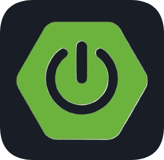

<!-- BANNER -->

<b><h1 align="center">SOFTWARE ENGINEER</h1></b>

<!-- ANIMATED BYE -->
<!--  -->

<!-- ANIMATED LINE -->
<!-- </h1></b> -->
<!-- 

 -->

<!-- ANIMATED GIF -->

<!-- PROFILE VIEWS -->

  

<!-- ABOUT ME -->
<h3 align="left">About me :</h3>

- 👨‍💻 Portfolio: [abhishekrajput.me](https://abhishekrajput.me)
  
- 🔭 Associate Product Developer at [BMC Software](https://www.bmc.com/)

- 🔗 Resume: [Google Drive Link](https://drive.google.com/drive/folders/1O0S098cwZgLoihe5RTv_5qNV7xrXj6qT)

- 🌱 I’m currently learning **Kubernetes**

- 📫 Reach me at **abhishek25022004@gmail.com**

<h3 align="left">Try it out !</h3>

> [!NOTE]
> Some of these projects are hosted on Render and may take around ~30-60 seconds to load. Thank you for your patience!

 | Project | Hosting Platform |
|-------------|-------------|  
| [Github Followers Tracker](https://git-followers-tracker.vercel.app) | Vercel | 
| [CalcHub](https://calc-hub-abhi.netlify.app/) | Netify |
| [Git Share](https://gitshare.onrender.com/) | Render |
| [Shortify- URL Shortener](https://url-shortener-beige-phi.vercel.app/) | Render, Vercel |
| [Multi-QR Encoder Decoder](https://multi-qr-encoder-decoder.onrender.com) | Render |
| [MERN Chatbot](https://mern-chatbot-kappa.vercel.app/) | Render, Vercel |

<!-- SOCIAL MEDIA -->
<h3 align="left">Connect with me :</h3>

<!--  -->
<!--  -->

  
<!-- BUY ME A COFFE -->

<!-- Experience -->
<h3 align="left">Experience :</h3>

| Role | Company | Start | End |
|-------------|--------|----|----|
| Associate Product Developer | [BMC Software](https://www.bmc.com/) | July 2026 | Present |

<!-- INTERNSHIPS -->
<h3 align="left">Internships :</h3>

| Role | Company | Start | End |
|-------------|--------|----|----|
| Product Developer Intern | [BMC Software](https://www.bmc.com/) | Jan 2026 | June 2026 |
| Product Developer Intern | [BMC Software](https://www.bmc.com/) | Jan 2025 | June 2025 |
| Project Developer Intern & Android Developer Intern | [SpacECE](https://www.spacece.in/) | Dec 2024 | Feb 2025 |
| Software Developer Intern & Android Developer Intern | [Alpinedge Solution](https://www.linkedin.com/company/alpinedge-solution-pvt-ltd/posts/?feedView=all) | Jul 2024 | Dec 2024 |
| Full Stack Web Developer Intern | [Project Human City](https://www.projecthumancity.com/) | Jun 2024 | Aug 2024 |
| Full Stack Web Developer Intern | [Meta Craftlab](https://craftlab.ai/)  | Jun 2024 | Jul 2024 |
| Networking Intern | [Cisco Networking Academy](https://www.netacad.com/) | May 2024 | Jul 2024 |

<h3 align="left">Academics :</h3>

| Institution | Degree | Start | End | 
|-------------|--------|------|------|
| Symbiosis International University, Pune | B.Tech, Computer Science and Engineering | 2022 | 2026 |
| Atomic Energy Central School | Higher Secondary Education | 2019 | 2022 | 

<!-- ANIMATED LINE -->
<!--  -->

<h3 align="center">Programming Languages</h3>

  

<h3 align="center">Java Development</h3>

  

<h3 align="center">Android Development</h3>

  

<h3 align="center">MERN Development</h3>

  

<h3 align="center">Python Development</h3>

  

<h3 align="center">DevOps</h3>

  

<h3 align="center">DB and Other Tools</h3>

  

<!-- WHITE THEME STATS-->
<!-- 

 -->
<!-- Most Used Lang-->
<!-- 

 -->
<!-- Streak-->
<!-- 

 -->
 

<!-- ANIMATED ROCKET -->
<h2 align="left"> Github Stats 

<!-- ANIMATED LINE -->
<!--  -->

<!-- GITHUB STATS -->

  

<!-- LANGUAGES USED -->
<!-- STREAK -->

  

<!-- CONTRIBUTION SNAKE -->

<!-- BOTTOM FLOWING ANIMATION -->

